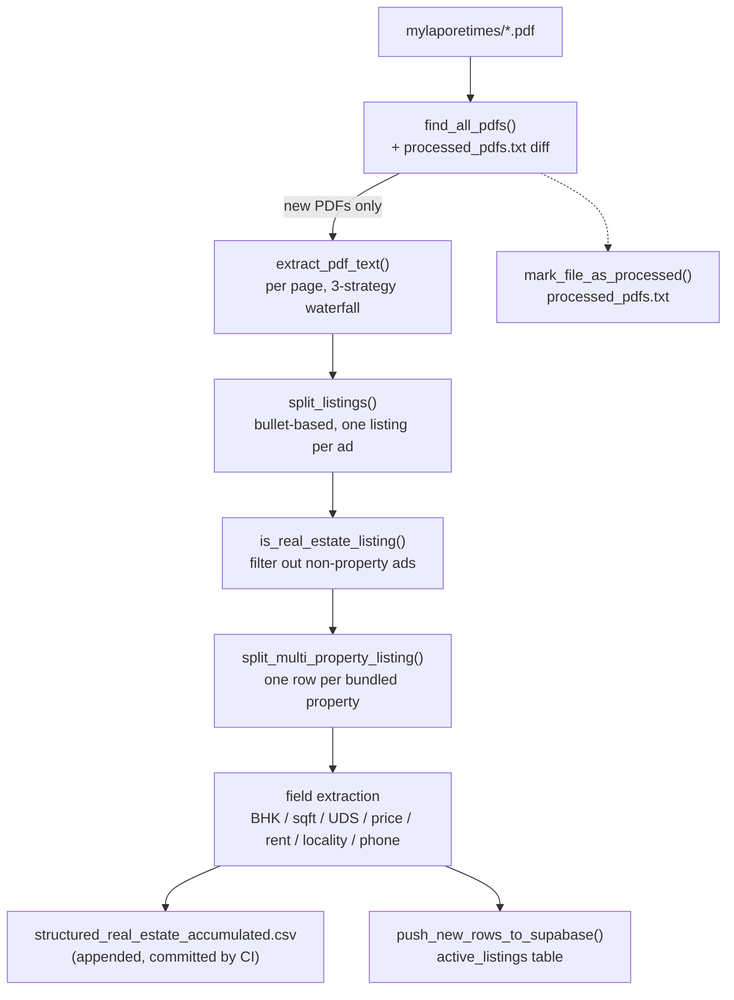

# Architecture & Design

This document describes how `newspaper-extract` turns scanned/digital PDF classifieds
from *Mylapore Times* into structured real-estate listing data, how the pipeline is
wired into CI/CD and Supabase, and the reasoning (and open risks) behind the design.

It reflects the state of the repo as of the extraction-pipeline rewrite and locality
overhaul described in the commit history (`unified_newspaper_extraction2.py`).

---

## 1. What this repo does

Each issue of *Mylapore Times* publishes a multi-page, multi-column classifieds
section as a PDF. This repo:

1. Watches `mylaporetimes/*.pdf` for new issues.
2. Extracts the classifieds text from each new PDF, coping with a 2-4 column
   newspaper layout, occasional scanned pages, and inconsistent PDF font encoding.
3. Splits the raw text into individual listings (one per bullet).
4. Detects listings that bundle more than one property under one contact number
   and splits them into one row per property.
5. Parses each listing into structured fields: locality, property type, BHK,
   built-up sqft, UDS sqft, floor, facing, sale price / rent, and phone numbers.
6. Appends the new rows to `structured_real_estate_accumulated.csv` (the running,
   version-controlled dataset) and inserts them into a Supabase table
   (`active_listings`) for querying.
7. Runs this automatically via GitHub Actions whenever a new PDF is pushed to
   `mylaporetimes/`.

There is no LLM in this pipeline. Everything is deterministic: `pdfplumber` for PDF
parsing, `pytesseract`/Tesseract as an OCR fallback, and hand-written regex/heuristics
for field extraction. This was a deliberate choice for cost and reproducibility on a
narrow, well-understood document format — see [§7](#7-design-considerations--tradeoffs).

---

## 2. Repository map

| Path | Role |
|---|---|
| `unified_newspaper_extraction2.py` | The pipeline. Single script, run top-to-bottom via `run_pipeline()`. This is the only file CI/CD invokes. |
| `chennai_localities.csv` | Lookup list of ~179 Chennai-area locality names, loaded by `Config.LOCALITIES` at import time. |
| `mylaporetimes/*.pdf` | Source PDFs, one per issue (roughly two per week: `-1.pdf` and `-2.pdf`). |
| `structured_real_estate_accumulated.csv` | The output dataset. One row per property. Append-only across runs; committed to git as the audit trail. |
| `processed_pdfs.txt` | Append-only log of PDF filenames already extracted. This is the pipeline's *only* idempotency mechanism — see [§6](#6-incremental-processing--idempotency). |
| `.github/workflows/extract-and-sync.yml` | CI/CD: runs the pipeline on push, commits the updated CSV/log, and (via env secrets) syncs new rows to Supabase. |
| `requirements.txt` | Runtime deps: `pandas`, `pdfplumber`, `pytesseract`, `Pillow`, `requests`. |
| `.env.example` | Documents the two env vars (`SUPABASE_URL`, `SUPABASE_SERVICE_KEY`) the script reads; never contains real values. |
| `AImodel_1.py` | Standalone, not wired into the pipeline. A scikit-learn RandomForest scaffold that reads the structured CSV as training data (price/locality features). Exploratory; not run by CI. |
| `verify_output.py` | Standalone manual QA script — prints row counts, per-source-file breakdowns, and sample rows from the CSV. Not run by CI. |

`__pycache__/` is gitignored; `raw_listings_temp.csv` is a transient per-run file the
pipeline deletes on success (gitignored in case a failed run leaves it behind).

---

## 3. End-to-end data flow



Everything downstream of "new PDFs only" only ever sees the PDFs not already listed
in `processed_pdfs.txt` — a full run over all 39 current PDFs vs. a run after one new
PDF is added does the same work, just over a smaller input set.

---

## 4. PDF text extraction — the hard part

### 4.1 Why this is hard

*Mylapore Times* classifieds are printed in a 2-4 column grid with irregular section
breaks (headlines, house ads, rule lines) interrupting the grid at different points on
different pages. Two off-the-shelf approaches were tried and both failed in
non-obvious ways on this specific layout:

- **`pdfplumber.extract_text(layout=True)`** (which delegates to `pdfminer`'s
  layout engine) tries to preserve on-page x-positions using literal spaces. On
  tightly-packed multi-column text it frequently **zips two adjacent columns
  together character-by-character** on the same output line — e.g. two real, unrelated
  ads would visually interleave into one line of garbage that no downstream regex
  could parse. This wasn't a systematic failure — the vast majority of the page would
  extract cleanly, with just isolated lines quietly corrupted. So a naïve pipeline
  built on `layout=True` looked like it worked fine on a spot check.
- **A single page-wide column-gutter histogram** (bin the x-position of every word on
  the page, treat any consistently-empty vertical strip as a column boundary) is fooled
  by a handful of full-width lines — mastheads, section headers, horizontal rules —
  that happen to cross exactly where the real gutter is. Those few lines fill in the
  "gutter" bins for the *entire page*, erasing an otherwise near-perfectly-consistent
  column boundary that holds for 90%+ of the page's vertical extent.

### 4.2 The three-strategy waterfall (`extract_pdf_text`)

Per page, in order, first strategy to produce ≥30 characters of output wins:

1. **Word-position column reconstruction** (`_words_to_column_text`) — the primary
   strategy, described in detail below. Works directly from `pdfplumber`'s per-word
   bounding boxes (`extract_words`), never delegates to `pdfminer`'s layout engine.
2. **`layout=True`** — fallback only, used when word extraction returns nothing
   (rare: a PDF with no extractable word objects at all).
3. **OCR** (`pytesseract` on a 300dpi render of the page) — last resort for scanned
   pages with no text layer, or any page where both prior strategies produced under 30
   characters. Tesseract must be installed separately (`apt-get install tesseract-ocr`
   in CI); if it's missing, `_ocr_page` swallows the exception and returns `""`.

### 4.3 Column detection: band-voted gutters (`_detect_column_bounds`)

Instead of one page-wide histogram, coverage is computed in horizontal bands
(50pt tall) and a bin only counts as part of a real gutter if it's empty in **≥60% of
the bands that have any content on them** (blank bands, e.g. white space at the top of
a page, are excluded from the vote so they can't dilute the threshold). This makes the
detector robust to a handful of outlier full-width lines: a masthead spanning the
gutter in 2 of 20 content-bearing bands doesn't override what the other 18 agree on.

```
n_bins = 200            # x-axis resolution (finer than the old 80-bin approach)
band_h = 50.0            # px-tall horizontal slices
threshold = 0.6          # fraction of content-bearing bands that must be empty
min_gutter_bins ≈ 1%     # of page width, to reject narrow inter-word gaps
```

### 4.4 Line clustering within a column: tolerance, not a fixed grid

An earlier version grouped words into lines via `int(top / line_h)` — i.e. divide the
page into fixed-height buckets and treat same-bucket words as one line. This has a
subtle failure mode: if `line_h` is even slightly smaller than the real line-to-line
spacing (which it was, having been derived as `avg_glyph_height * 0.65`), a single
physical line's words can straddle a bucket boundary due to ordinary glyph-height
jitter, silently splitting one line into two — or worse, merging tail words of one
line with head words of the next when the boundary lands wrong.

The current approach clusters top-to-bottom within each column by comparing each
word's `top` to a **running reference** (the minimum `top` seen in the line being
built so far), starting a new line only when the gap exceeds
`max(2.0, glyph_height * 0.5)`. This has no fixed grid to straddle.

### 4.5 Word joining: gap-aware, not "always insert a space"

Even with correct line clustering, one more surprise turned up: this specific PDF's
font occasionally tokenizes a single word into separate one-character word objects at
kerning-pair boundaries (`"UDS"` → three separate word objects: `'U'`, `'D'`, `'S'`).
Naively joining every word in a line with a literal space produced outputs like
`"U D S 6 8 0"` for `"UDS 680"`.

Fixed by measuring the actual gap between adjacent words' bounding boxes
(`_join_line_words`) and only inserting a space when the gap exceeds **0.6pt** — a
threshold picked empirically from this PDF's real gap distribution: character-glue
gaps cluster at 0–0.5pt, real word-to-word gaps at ≥0.8pt even at small font sizes,
with a clean valley between them (verified by histogramming gaps across a full page).

---

## 5. Listing splitting (`split_listings`)

Classifieds are bulleted; each bullet is one ad. The splitter:

1. Normalizes bullet glyphs (`•`, `●`, `▪`, `‣` → `·`).
2. Forces any bullet found mid-line onto its own line (a residual artifact of
   column-adjacent text landing on the same output line even after the extraction
   fixes above) so the line-based splitter below sees it as a listing start.
3. Splits into lines, and starts a new listing whenever a line begins with a bullet
   character **or** looks like `ALL CAPS LOCALITY,` (a fallback for ads whose bullet
   didn't survive extraction).
4. One more bullet form is recognized explicitly: a lone lowercase **`l`** at the
   start of a line. This isn't OCR noise — in a handful of issues, the bullet glyph's
   font encoding decodes to the letter `l` in `pdfplumber`'s output, while the
   surrounding text extracts perfectly cleanly. Without this, those issues' ads
   silently merge into a handful of giant blobs (observed: one issue dropped from
   ~65 listings to 12 before this fix was added).
5. Listings under 30 characters are dropped (guards against a stray bullet with no
   real content following it).

---

## 6. Incremental processing & idempotency

`processed_pdfs.txt` is the *only* source of truth for "has this PDF been handled."
`run_pipeline()`:

1. Globs all PDFs, diffs against the log to get `new_pdfs`.
2. Extracts + structures only `new_pdfs`, appends to the CSV
   (`process_listings_to_structured(..., append_mode=True)`).
3. **Pushes to Supabase before marking anything processed** — if the Supabase push
   raises (network error, bad key, RLS rejection), the log is left untouched, so the
   same PDFs are retried (and re-pushed) on the next run instead of silently losing
   rows from Supabase.
4. Only then appends the new filenames to `processed_pdfs.txt`.

This ordering trades a known, documented gap for simplicity: if step 2 succeeds
(CSV updated) but step 3 fails, a retry will **re-append the same PDF's rows to the
CSV a second time**, since `append_mode` doesn't dedup against existing content — it
only decides *whether* to concat, not against *what's already there*. This was a
deliberate simplification (see [§7](#7-design-considerations--tradeoffs)); it's an
edge case on partial failure, not the common path.

There is no per-row dedup key anywhere in the pipeline — dedup happens entirely at
the PDF-file level via this log.

---

## 7. Design considerations & tradeoffs

**No LLM / no external extraction API.** The document format is narrow and stable
(one newspaper, one classifieds layout convention) and the corpus is processed
incrementally forever, so a deterministic, free, fully-inspectable regex pipeline was
chosen over an LLM call per listing. The tradeoff is brittleness to layout/wording
drift the regexes don't anticipate (see [§8](#8-known-limitations--open-risks)).

**Word-position extraction as primary, `layout=True` as fallback (not the reverse).**
`layout=True` is what most `pdfplumber` tutorials point to first, but it was found to
silently corrupt multi-column text often enough on this specific document that
building a purpose-built column reconstructor was worth the extra code. It's kept as
a fallback for the rare case where `extract_words` returns nothing.

**Band-voted column detection over a global histogram.** A single page-wide
histogram is a natural first implementation, but this specific document's mix of
full-bleed headers and multi-column body text defeats it. Band-voting was chosen
over more general approaches (e.g. recursive XY-cut / full document-layout
segmentation) as the smallest change that fixed the observed failure mode without
building a general-purpose layout engine.

**Multi-property splitting keyed off the locality list.** Detecting "this one bullet
actually advertises two properties" is done by (a) flagging listings with ≥2 `sq.ft`
or `UDS` mentions, then (b) finding ≥2 distinct locality names in the same text and
splitting at those boundaries, re-attaching the shared phone number to each part. This
directly ties split quality to locality-list *completeness* — see the coupling risk in
[§8](#8-known-limitations--open-risks).

**Locality matching: punctuation/spacing-tolerant, leftmost-match-wins.** Real
listings write the same locality inconsistently (`"T Nagar"` / `"T. Nagar"` / `"T
NAGAR"`, `"R A Puram"` / `"R.A.Puram"` / `"Raja Annamalaipuram"`). Locality name
matching strips periods and collapses whitespace on both sides before comparing, and
`"Long Name (Alias)"` entries in the source CSV are expanded into two independently
matchable variants. Whichever locality's regex fragment matches **earliest in the raw
text** wins (`pattern.search()` semantics) — this replaced an earlier version that
returned whichever locality happened to appear first in the *hardcoded Python list*,
which was frequently wrong for listings mentioning multiple areas.

**Supabase auth: `service_role`/secret key, not the publishable/anon key.** The
`active_listings` table has no RLS policy permitting anon inserts (and none was
added), so CI authenticates with a full-access secret key, injected only via GitHub
Actions secrets and a local, gitignored `.env` — never committed. This was chosen
over adding an anon-insert RLS policy to keep the table's default posture
locked-down; the CI job is the only writer.

**Dedup via file-level log, not a DB unique constraint.** `active_listings` has no
unique constraint beyond its identity `ID` column. Rather than adding one (e.g. a
hash of `source_file + listing_text`) and using `upsert`, dedup relies entirely on
`processed_pdfs.txt` gating which PDFs get (re-)processed at all. Simpler, but see the
retry-duplication gap in [§6](#6-incremental-processing--idempotency) and the dedup
risk in [§8](#8-known-limitations--open-risks).

**CSV committed to git as the audit trail, not just a CI artifact.** Every pipeline
run's output is committed back to the repo by the workflow, so the dataset's full
history is `git log`-able and diffable, at the cost of repo size growing roughly
linearly with issues processed (see [§8](#8-known-limitations--open-risks)).

---

## 8. Known limitations & open risks

- **Residual extraction garbling.** After all the fixes above, a full-corpus check
  found roughly 0.2% of rows still character-spaced or otherwise garbled — mostly
  decorative masthead text (`"MYLAPORE TIMES"`) or headings set in unusually wide
  letter-tracking that the word-gap heuristic in §4.5 doesn't fully account for. Not
  zero, but small enough that no further work was done here.

- **Multi-property split quality is coupled to locality-list completeness and can
  both under- and over-split.** *Under-split*: a bundled ad naming a street/landmark
  instead of a recognized locality (e.g. `"...Chandrabagh Avenue, 4770 sq.ft...."`)
  won't hit the ≥2-locality trigger and stays merged. *Over-split risk*: a single
  property's description that happens to name a second locality only as a landmark
  reference (`"near Anna Nagar signal"`) could in principle be mis-split — this was
  specifically tested against the current 179-name locality list and no false
  positives were found in spot checks, but it hasn't been exhaustively verified across
  the full corpus, and the risk grows as more localities are added to the lookup.

- **No DB-level dedup.** If `processed_pdfs.txt` is ever reset, edited by hand, or
  lost, the next run will treat all PDFs as new and duplicate every row into both the
  CSV and Supabase. This is the direct consequence of the "rely on the file log"
  choice in §7; the more robust alternative (a content-hash unique constraint +
  `upsert`) was explicitly not built.

- **Locality list is likely still incomplete for this specific newspaper's
  spelling conventions.** `chennai_localities.csv` is a general Chennai-area gazetteer;
  seven aliases were added on top of it after finding real mismatches against this
  newspaper's actual usage (`Abiramapuram` vs `Abhiramapuram`, `R A Puram` vs
  `R.A.Puram` vs `Raja Annamalaipuram`, etc.) by diffing extraction output against the
  full corpus. There is no guarantee every such variant has been found — new issues
  may still surface listings with an unrecognized locality spelling, which will
  silently leave `locality` blank rather than erroring.

- **Field-extraction regexes are tuned to observed formats, not exhaustive.** BHK,
  sqft, UDS, price, and rent extraction (`extract_bhk`, `extract_sqft`, etc.) are each
  a small number of regex patterns built against real examples seen in the corpus so
  far. A genuinely novel phrasing (e.g. a price written in a format never seen before)
  will silently produce a blank field rather than an error — there's no confidence
  score or extraction-failure signal surfaced anywhere downstream.

- **OCR fallback is effectively unexercised.** Every PDF processed so far had a
  usable text layer, so the `pytesseract` path (§4.2, strategy 3) has not been
  meaningfully tested against this corpus. If a future issue is a genuine scanned
  image with no text layer, extraction quality through that path is unverified.

- **Retry-after-partial-failure can duplicate CSV rows.** Documented in §6: if
  Supabase push fails after the CSV has already been written for that run, a retry
  reprocesses the same PDFs and appends their rows to the CSV again (Supabase itself
  won't get duplicates, since the log — and therefore the retry — only advances after
  a successful push). No automated recovery exists for this; it would need manual CSV
  dedup if it happens.

- **Repo size grows unbounded.** Both the source PDFs and the accumulated CSV are
  committed to git indefinitely. At current volume (~39 PDFs, ~3,264 rows) this is a
  non-issue; over years of biweekly issues it will eventually be worth revisiting
  (e.g. Git LFS for PDFs, or moving the CSV to being a generated artifact rather than
  a tracked file).

- **CI secret rotation is a manual, undocumented-in-code step.** `SUPABASE_SERVICE_KEY`
  must be rotated manually in both Supabase and the GitHub repo secret if ever
  compromised; nothing in the pipeline enforces or reminds about key rotation.

---

## 9. CI/CD (`.github/workflows/extract-and-sync.yml`)

- **Trigger**: push to `main` touching `mylaporetimes/**.pdf`, or manual
  `workflow_dispatch`.
- **Steps**: checkout → install Tesseract (`apt-get install tesseract-ocr`, required
  for the OCR fallback) → `pip install -r requirements.txt` → run
  `unified_newspaper_extraction2.py` with `SUPABASE_URL` / `SUPABASE_SERVICE_KEY` from
  repo secrets → commit `structured_real_estate_accumulated.csv` +
  `processed_pdfs.txt` back to the branch as a bot commit (message tagged
  `[skip ci]` so the bot's own commit can't re-trigger the workflow).
- **Concurrency**: a single `extract-and-sync` group with `cancel-in-progress: false`,
  so overlapping pushes queue rather than race on the committed CSV/log.
- Because the trigger only cares about files under `mylaporetimes/`, pushing PDFs and
  pushing code changes are independent — a code-only push to `main` does not run the
  extraction job.

---

## 10. Data model

### Structured CSV / `active_listings` columns

| Column | Type | Notes |
|---|---|---|
| `source_file` | text | Originating PDF filename |
| `listing_text` | text | The individual property's ad text (post-split, cleaned) |
| `city` | text | Always `"Chennai"` currently |
| `locality` | text | Canonical name from `chennai_localities.csv` / alias list, or blank |
| `property_type` | text | `Apartment` / `Independent House` / `Land` / `Commercial` / `Unknown` |
| `bhk` | text | Bedroom count, as extracted (blank if not found) |
| `sqft_builtup` | text | Built-up area |
| `sqft_uds` | text | Undivided share of land |
| `floor` | text | Floor number, as extracted |
| `facing` | text | `East`/`West`/`North`/`South` |
| `price_value` / `price_unit` / `price_in_inr` | text | Sale price, raw + normalized to INR |
| `is_rental` | boolean | Only real boolean column; everything else is `text` per the Supabase schema |
| `rent_value` / `rent_unit` / `rent_in_inr` | text | Rent, raw + normalized to INR |
| `contact_numbers` | text | Comma-joined 10-digit numbers found in the listing |

In Supabase, every non-boolean field is sent as either a JSON string or `null`
(`_to_supabase_row`) — empty CSV values become `NULL`, not empty strings, so the
column semantics stay clean for querying (`WHERE bhk IS NOT NULL` etc.) even though
the CSV itself uses `""` for the same "missing" case.

---

## 11. Possible future work

Not committed to, but worth knowing were considered/deferred during this design:

- A content-hash unique constraint on `active_listings` + `upsert`, replacing the
  file-log-only dedup strategy, to remove the risks described in §8.
- Surfacing extraction confidence / flagging rows where no field parsed cleanly,
  rather than silently leaving fields blank.
- A recursive XY-cut or other general document-layout segmentation, if a future issue
  has a column layout the current band-voting heuristic can't handle.
- Moving the CSV from a tracked git artifact to a generated build output, once repo
  size becomes a real concern.
